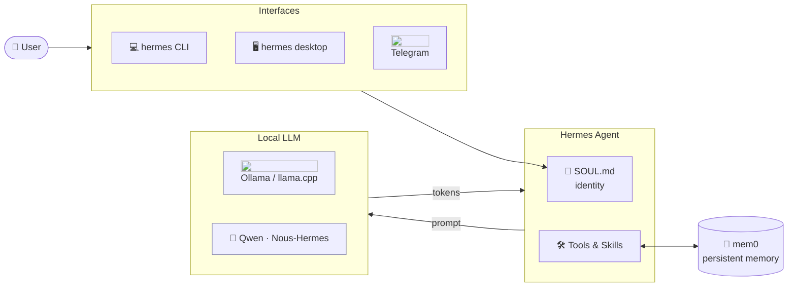

```mermaid
flowchart LR
    User(["👤 User"])

    subgraph Interfaces["Interfaces"]
        direction TB
        CLI["💻 hermes CLI"]
        Desktop["🖥️ hermes desktop"]
        TG["<img src='https://cdn.simpleicons.org/telegram/26A5E4' style='width:20px;height:20px;vertical-align:middle;margin-right:6px'/> Telegram"]
    end

    subgraph Core[" "]
        direction TB

        subgraph Agent["Hermes Agent"]
            direction LR
            Soul["📄 SOUL.md<br/>identity"]
            Tools["🛠️ Tools & Skills"]
        end

        subgraph LLM["Local LLM"]
            direction LR
            Runtime["<img src='https://cdn.simpleicons.org/ollama/000' style='width:20px;height:20px;vertical-align:middle;margin-right:6px'/> Ollama / llama.cpp"]
            Model["🦙 Qwen · Nous-Hermes"]
        end
    end

    Store[("💾 mem0<br/>persistent memory")]

    User --> Interfaces
    Interfaces --> Soul
    Agent -- "prompt" --> LLM
    LLM -- "tokens" --> Agent
    Tools <--> Store

    style Core fill:none,stroke:none
    classDef llm fill:#eef,stroke:#88a,stroke-width:1px
    class Runtime,Model llm
```
