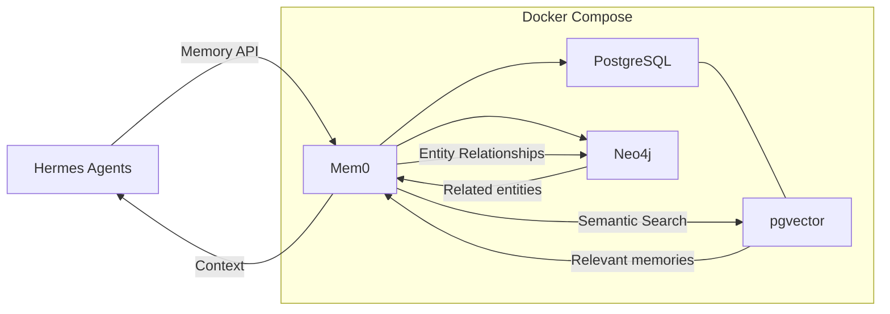

```mermaid
flowchart LR
    AGENTS[Hermes Agents]

    subgraph DOCKER["Docker Compose"]
        MEM0["Mem0"]

        POSTGRES["PostgreSQL"]
        PGVECTOR["pgvector"]
        NEO4J["Neo4j"]

        POSTGRES --- PGVECTOR

        MEM0 --> POSTGRES
        MEM0 --> NEO4J
    end

    AGENTS -->|"Memory API"| MEM0

    MEM0 -->|"Semantic Search"| PGVECTOR
    MEM0 -->|"Entity Relationships"| NEO4J

    PGVECTOR -->|"Relevant memories"| MEM0
    NEO4J -->|"Related entities"| MEM0

    MEM0 -->|"Context"| AGENTS
```
