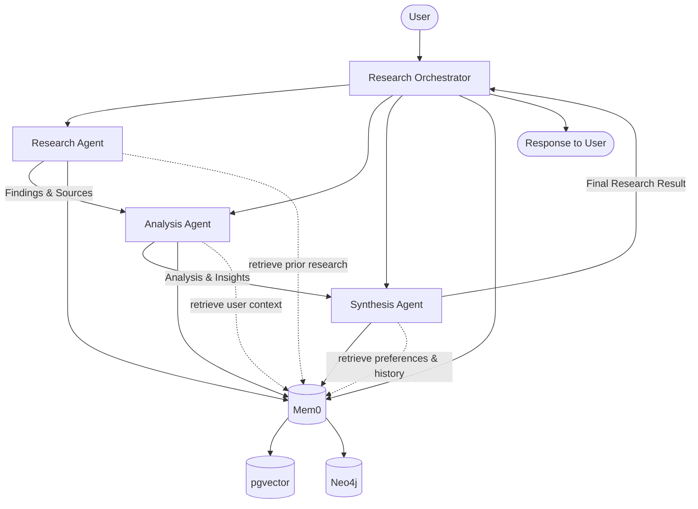

```mermaid
flowchart TD
    USER([User])

    USER --> ORCH[Research Orchestrator]

    ORCH --> RESEARCH[Research Agent]
    ORCH --> ANALYST[Analysis Agent]
    ORCH --> SYNTH[Synthesis Agent]

    RESEARCH -->|Findings & Sources| ANALYST
    ANALYST -->|Analysis & Insights| SYNTH
    SYNTH -->|Final Research Result| ORCH

    RESEARCH --> MEM[(Mem0)]
    ANALYST --> MEM
    SYNTH --> MEM
    ORCH --> MEM

    MEM --> PG[(pgvector)]
    MEM --> NEO[(Neo4j)]

    RESEARCH -.->|retrieve prior research| MEM
    ANALYST -.->|retrieve user context| MEM
    SYNTH -.->|retrieve preferences & history| MEM

    ORCH --> RESPONSE([Response to User])
```