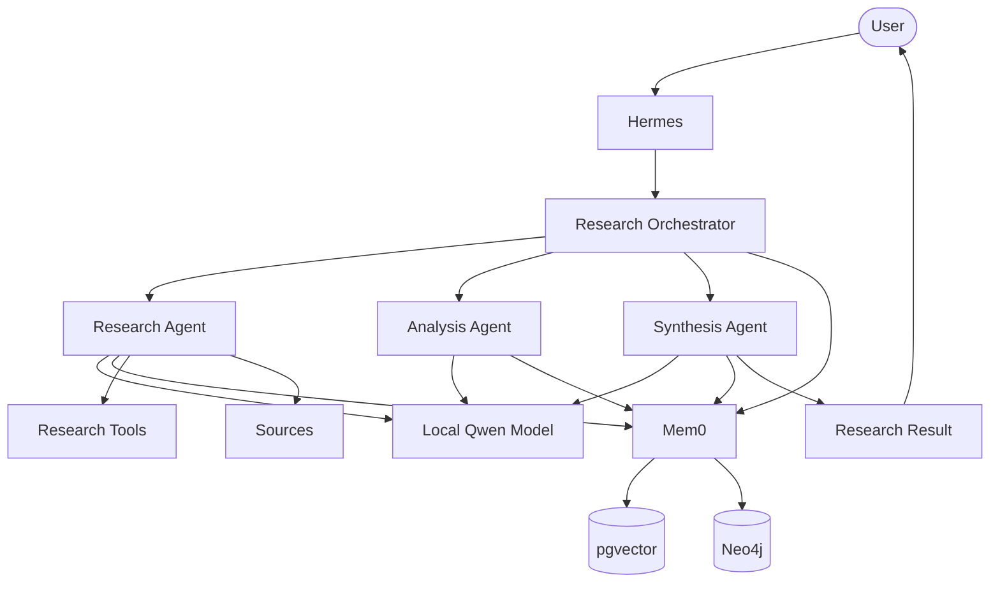

```mermaid
flowchart TB
    USER([User])

    USER --> HERMES[Hermes]

    HERMES --> ORCH[Research Orchestrator]

    ORCH --> R[Research Agent]
    ORCH --> A[Analysis Agent]
    ORCH --> S[Synthesis Agent]

    R --> QWEN[Local Qwen Model]
    A --> QWEN
    S --> QWEN

    R --> MEM0[Mem0]
    A --> MEM0
    S --> MEM0
    ORCH --> MEM0

    MEM0 --> PG[(pgvector)]
    MEM0 --> NEO[(Neo4j)]

    R --> TOOLS[Research Tools]
    R --> SOURCES[Sources]

    S --> RESULT[Research Result]
    RESULT --> USER
```
