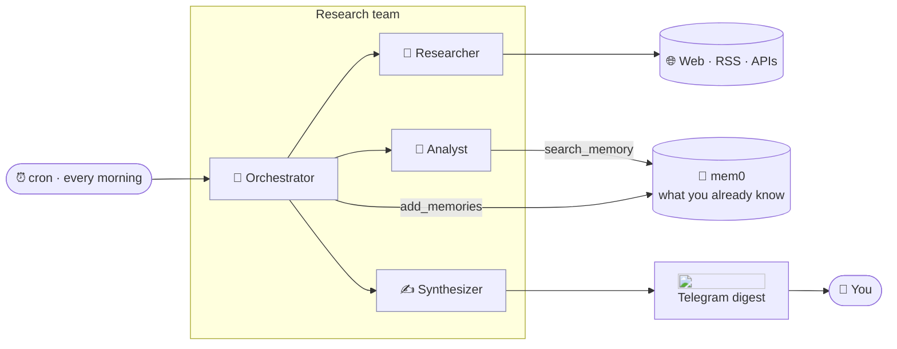

```mermaid
flowchart LR
    Cron(["⏰ cron · every morning"])

    subgraph Team["Research team"]
        direction TB
        Orch["🧭 Orchestrator"]
        R["🔎 Researcher"]
        A["🧠 Analyst"]
        S["✍️ Synthesizer"]
    end

    Sources[("🌐 Web · RSS · APIs")]
    Store[("💾 mem0<br/>what you already know")]
    TG["<img src='https://cdn.simpleicons.org/telegram/26A5E4' style='width:20px;height:20px;vertical-align:middle;margin-right:6px'/> Telegram digest"]
    User(["👤 You"])

    Cron --> Orch
    Orch --> R
    Orch --> A
    Orch --> S
    R --> Sources
    A -- "search_memory" --> Store
    Orch -- "add_memories" --> Store
    S --> TG
    TG --> User

    classDef agent fill:#eef,stroke:#88a,stroke-width:1px
    class Orch,R,A,S agent
```
