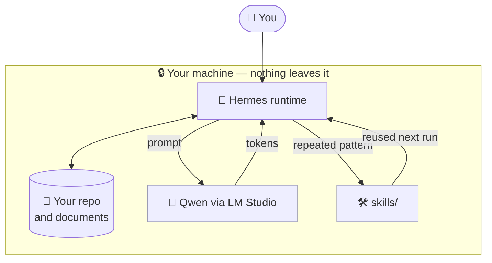

```mermaid
flowchart TB
    User(["👤 You"])

    subgraph Local["🔒 Your machine — nothing leaves it"]
        direction LR
        Hermes["🤖 Hermes runtime"]
        Files[("📁 Your repo<br/>and documents")]
        LLM["🦙 Qwen via LM Studio"]
        Skills["🛠️ skills/"]

        Hermes <--> Files
        Hermes -- "prompt" --> LLM
        LLM -- "tokens" --> Hermes
        Hermes -- "repeated pattern" --> Skills
        Skills -- "reused next run" --> Hermes
    end

    User --> Hermes

    classDef llm fill:#eef,stroke:#88a,stroke-width:1px
    class LLM,Skills llm
```
