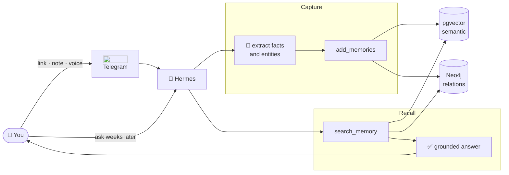

```mermaid
flowchart LR
    User(["👤 You"])
    TG["<img src='https://cdn.simpleicons.org/telegram/26A5E4' style='width:20px;height:20px;vertical-align:middle;margin-right:6px'/> Telegram"]
    Hermes["🤖 Hermes"]

    subgraph Write["Capture"]
        direction TB
        Facts["🧠 extract facts<br/>and entities"]
        Add["add_memories"]
    end

    subgraph Read["Recall"]
        direction TB
        Search["search_memory"]
        Answer["✅ grounded answer"]
    end

    PG[("pgvector<br/>semantic")]
    NEO[("Neo4j<br/>relations")]

    User -- "link · note · voice" --> TG
    TG --> Hermes
    Hermes --> Facts
    Facts --> Add
    Add --> PG
    Add --> NEO
    User -- "ask weeks later" --> Hermes
    Hermes --> Search
    Search --> PG
    Search --> NEO
    Search --> Answer
    Answer --> User
```
