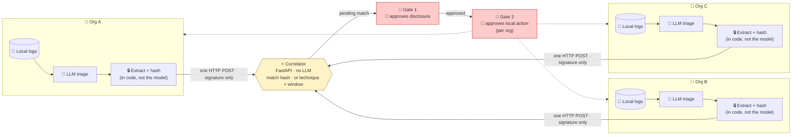

```mermaid
flowchart LR
    subgraph OrgA["🏢 Org A"]
        direction TB
        LogsA[("📄 Local logs")]
        LLMA["🧠 LLM triage"]
        HashA["🔒 Extract + hash<br/>(in code, not the model)"]
        LogsA --> LLMA --> HashA
    end

    subgraph OrgB["🏢 Org B"]
        direction TB
        LogsB[("📄 Local logs")]
        LLMB["🧠 LLM triage"]
        HashB["🔒 Extract + hash<br/>(in code, not the model)"]
        LogsB --> LLMB --> HashB
    end

    subgraph OrgC["🏢 Org C"]
        direction TB
        LogsC[("📄 Local logs")]
        LLMC["🧠 LLM triage"]
        HashC["🔒 Extract + hash<br/>(in code, not the model)"]
        LogsC --> LLMC --> HashC
    end

    Correlator{{"⚡ Correlator<br/>FastAPI · no LLM<br/>match hash · or technique + window"}}
    Gate1["🚪 Gate 1<br/>👤 approves disclosure"]
    Gate2["🚪 Gate 2<br/>👤 approves local action<br/>(per org)"]

    HashA -- "one HTTP POST · signature only" --> Correlator
    HashB -- "one HTTP POST · signature only" --> Correlator
    HashC -- "one HTTP POST · signature only" --> Correlator

    Correlator -- "pending match" --> Gate1
    Gate1 -- "approved" --> Gate2
    Gate2 -.-> OrgA
    Gate2 -.-> OrgB
    Gate2 -.-> OrgC

    classDef server fill:#fef3c7,stroke:#a16207,stroke-width:1px
    classDef gate fill:#fecaca,stroke:#b91c1c,stroke-width:1px
    class Correlator server
    class Gate1,Gate2 gate
```
